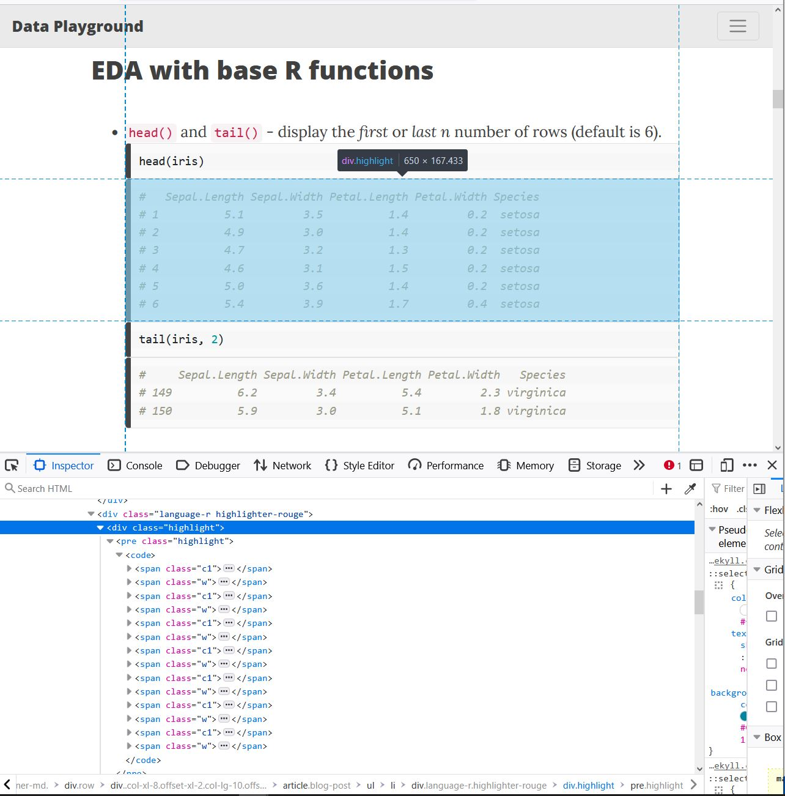
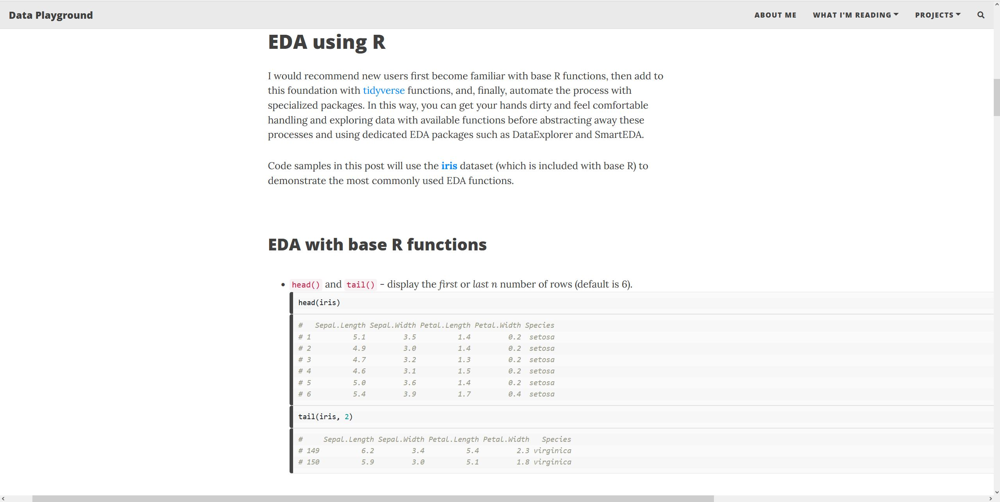

I built this site using the [Beautiful Jekyll](https://github.com/daattali/beautiful-jekyll) template, created by Dean Attali. Beautiful Jekyll is an elegant and attractive starting layout, but I identified and incorporated three features to improve my site's overall appearance: animations when loading a new page, favicons, and improved mobile layout.

<br>

**Table of Contents:**

- [Applying Custom CSS to Beautiful Jekyll](#applying-custom-css-to-beautiful-jekyll)
- [Creating a Page Transition Animation](#creating-a-page-transition-animation)
- [Adding Favicons](#adding-favicons)
- [Improving Mobile Layout](#improving-mobile-layout)
- [Summary](#summary)
- [Resources](#resources)


<br>

# Applying Custom CSS to Beautiful Jekyll

To overwrite default styles with Beautiful Jekyll, instead of modifying the site's existing CSS files (e.g., "/assets/css/beautifuljekyll-minimal.css"), follow the instructions from the Beautiful Jekyll [FAQ](https://beautifuljekyll.com/faq/):

{: .box-note}
"How do I make small modifications to how my website looks?"

{: .box-note}
"If you want to make any visual changes that are not in _config.yml, you’ll need to add your own CSS rules to the file assets/css/custom-styles.css and enable the site-css setting in the config file. This will allow you to overwrite the default Beautiful Jekyll styles."

Many visual changes to the default Beautiful Jekyll style (e.g., page color, fonts) can be easily made in the _config.yml file. However, to implement other custom changes that were not supported by the config file, I enabled the site-css setting and created a new CSS file where I could add custom CSS that would apply to the whole site.

``` yml
# For any extra visual customization, you can include additional CSS files in every page on your site. List any custom CSS files here

site-css:
  - "/assets/css/custom-styles.css"
```


<br>

# Creating a Page Transition Animation

 Using a Youtube [tutorial](https://www.youtube.com/watch?v=zWB219zf1og) created by [dcode](https://www.youtube.com/c/dcode-software), I added a subtle animation which appears every time a new page of my site loads.

 Following this tutorial, the process is very straightforward.
 1) Create or add to an existing CSS file, then define:
    1) An animation that transitions between two "key frames" (in other words, how the page should look at the start and end of the animation).
    2) The duration of the transition.
    3) The target(s) for the animation (which part of your site pages should be animated?).
 2) In the site HTML code, link the CSS file to the page headers.

<br>

The code generally follows this structure:

```css
.className {
    animation: transitionIn duration;
}

@keyframes transitionIn {
    from {
        opacity: 0;
        transform: rotateX(-10deg);
    }

    to {
        opacity: 1;
        transform:rotateX(0deg);
    }
}
```

<br>

When a new page loads, it triggers an animation that transitions the page from one keyframe (fully transparent, slightly rotated) to another (fully opaque, no rotation).  

The "className" should match the element you want to target with the animation—I choose to target the entire body element, and set the animation duration to 0.75 seconds.

```css
body {
    animation: transitionIn 0.75s;
}

@keyframes transitionIn {
... 
}

```
<br>

The animation works, but I find that, when the entire body is targeted, something looks off. One possible explanation is that when the navigation bar is animated, it gives me the impression that the site is lagging and loading slowly.

<br>

To make the animation more subtle, I test the appearance of the animation if it only targets the main content and the headers (which includes the page title and subtitle); the remaining site components (navigation bar and footer bar) will load normally. In the Beautiful Jekyll site code, the main content of each page is defined with the "role" attribute: `role="main"`. The page headers are defined with the class attribute: `class="header-section"`. With this information, I can specify that the transition animation should only apply to these parts of the page.

```css
div[role=main], .header-section {
    animation: transitionIn 0.75s;
}

@keyframes transitionIn {
...
}
```

<br>

The final result is a subtle change to the site appearance when a new page loads.


<div>
    <iframe id="video" width=650 height=400 src="https://rkhouri.github.io/assets/img/site-improvements/site-animation.mp4">
    </iframe>
</div>

<br>

----

# Adding Favicons

A favicon is that helpful little buddy that helps you quickly identify website among the hundreds fo tabs you have open, or to know what site to expect when someone sends link to your phone. Once I noticed that my site was missing one, it was all I could see when I pulled up the site.

Favicon support and requirements vary between browsers and OS; as a result, they are quite a mess to untangle. One easy way to design a favicon, create the required files, and confirm functionality is to use [RealFaviconGenerator](https://realfavicongenerator.net/), a tool created by Philippe Bernard. With this site, you can customize favicons and the site will do the hard work of generating the required files for compatibility with all major browsers and devices. You can also plug in your site URL to to the [favicon checker tool](https://realfavicongenerator.net/favicon_checker) to confirm things are working properly on OS you might not use. The site's [FAQ](https://realfavicongenerator.net/faq) page includes lots of information about favicons and browser requirements, if you are curious to learn more.

Now my site has an icon when viewed in all browsers, and also when saved as a shortcut on mobile phones. And, if I send the link to my site on a mobile device, the preview shows the favicon! All together, the site feels much more professional.

</img>
</img>
</img>

<br>

# Improving Mobile Layout

Beautiful Jekyll already incorporates responsive design elements (*i.e.*, the site adjusts to fit differently-sized screens in order to keep the page content readable whether you view it on a desktop or mobile device). But I notice that, unlike the home page, About Me page, and the Reading List page, some of my blog posts do not scale well to a mobile layout. Originally I thought this was due to a difference in the base code between post layouts and other page layouts, but my first blog post resizes properly on a phone screen, so there must be something else causing this.

</img>

After searching for a common thread between the pages that are not responsive to screen size, I believe the culprits are code samples. Based on this theory, I want to set the width of my code blocks to see if this resolves the issue. After some troubleshooting, I find that the lowest level that I can edit to adjust the width of the code block is the `<pre>` element with the class "highlight".



Instead of setting a value, I want to specify a width that scales based on the width of the user's screen. Enter: the "vw" unit! This unit is relative to the viewport, and 100vw are equivalent to the 100% of the width of the viewport. Handily, the viewport of a page can be set equal to the screen size using CSS (which the Beautiful Jekyll base code already includes): 

```css
<meta name="viewport" content="width=device-width, initial-scale=1, shrink-to-fit=no">
```

So, I return to my custom CSS file in my site directory and change the default width of all code blocks to be equal to the width of the viewport.

```css
.highlight pre {
    width: 100vw;
}
```

Now code blocks look great on my phone! However, when I switch back to a desktop screen, the code chunks are waayyy too wide because I have not set a max width. 



<br>

```css
.highlight pre {
    width: 100vw;
    max-width: 100%;
}
```

Now, code blocks do not affect the ability of my site pages to scale responsively to device screen size!

<br>

# Summary

Templates are a great tool to launch a new site through GitHub Pages. Numerous Jekyll templates are available and free to use, including Dean Attali's Beautiful Jekyll; sites built from these templates can then be customized to add user-specific design elements. Customizing a site built from a template is a great beginner-friendly way to make small design personalizations and learn basic web design skills without needing to build a site from scratch.

- New to CSS and HTML? Work through introductory tutorials to get comfortable with the basics before diving into site modifications.
- Lacking inspiration? YouTube tutorials can help get the juices flowing. 
- Want to make your site look more professional across all browsers and devices? Add a favicon using the RealFaviconGenerator tool, and make sure your site incorporates responsive design elements.

<br>

# Resources

- [Beautiful Jekyll FAQ](https://beautifuljekyll.com/faq/)
  
- [W3 Schools: CSS Tutorial](https://www.w3schools.com/css/default.asp). A great 30-minute tutorial (with practice prompts) for beginners to learn CSS basics.

- [W3 Schools: HTML Tutorial](https://www.w3schools.com/html/). A thorough introductory tutorial to learn HTML basics.
  
- [Create Transitions/Animations on Page Load with HTML & CSS - Web Design Tutorial](https://www.youtube.com/watch?v=zWB219zf1og)
   
- [RealFaviconGenerator](https://realfavicongenerator.net/)
  
- [W3 Schools: HTML Responsive Web Design](https://www.w3schools.com/html/html_responsive.asp)